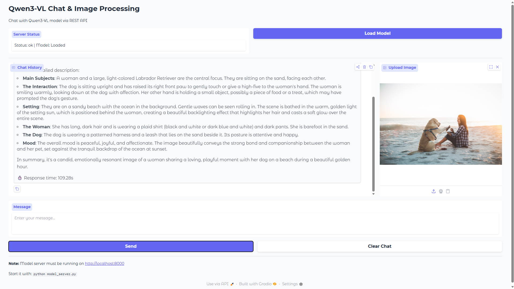

# Qwen3-VL Chat & Image Processing App

A multimodal AI chat application built with [Gradio](https://www.gradio.app/) and [Qwen3-VL](https://huggingface.co/Qwen/Qwen3-VL-8B-Instruct) that can process text messages and images. The application uses GPU acceleration with 4-bit quantization for efficient inference.



> ⚠️ **Learning Opportunity**: This application is created for educational and learning purposes only. It demonstrates how to integrate multimodal AI models with web interfaces using Gradio and REST APIs.

## Architecture

The application uses a **disaggregated architecture** with separate frontend and backend services:

- **Frontend** (`app.py`): Gradio web UI running on port 7860
- **Backend** (`model_server.py`): FastAPI model server running on port 8000

The frontend communicates with the backend via REST API, enabling scalability and independent service management.

## Features

- **Multimodal Chat Interface**: Text and image processing in one unified interface
- **Disaggregated Architecture**: Separate frontend (Gradio) and backend (FastAPI) services
- **GPU-Accelerated Inference**: Automatic GPU detection with `device_map="auto"`
- **4-bit Quantization**: Memory-efficient model loading using BitsAndBytes
- **Conversation History**: Maintains context of last 5 messages
- **Response Timing**: Real-time performance metrics
- **Health Monitoring**: Built-in health checks for model server
- **Standalone Mode**: Option to run Gradio without separate backend (`full-app.py`)
- **API Documentation**: Auto-generated interactive API docs via FastAPI

## Setup

### Prerequisites

- NVIDIA GPU with CUDA support (recommended: 12GB+ VRAM)
- Conda environment with Python 3.12
- Qwen3-VL-8B-Instruct model downloaded

### 1. Install Dependencies

```bash
pip install -r requirements.txt
```

Or use conda:
```bash
conda run -n aiops-py312 pip install -r requirements.txt
```

Required packages:
- `transformers` - Hugging Face transformers library
- `torch` - PyTorch with CUDA support
- `gradio` - Web UI framework
- `fastapi` - REST API backend
- `uvicorn` - ASGI server
- `bitsandbytes` - 4-bit quantization
- `accelerate` - Model parallelism
- `pillow` - Image processing
- `requests` - HTTP client

### 2. Verify Qwen Model Path

The app expects the Qwen3-VL model at:
```
/root/workspace/lnd/aiops/vlm/Qwen/Qwen3-VL-8B-Instruct
```

To use a different path, update `MODEL_PATH` in `model_server.py`:

```python
MODEL_PATH = Path("/path/to/your/Qwen3-VL-8B-Instruct")
```

## Usage

### Option 1: Start Both Services (Recommended)

Use the provided startup script:

```bash
./start.sh
```

This will:
- Clean up any existing processes
- Start the model server on port 8000
- Start the Gradio frontend on port 7860
- Save logs to `logs/` directory
- Show real-time status updates

### Option 2: Standalone Gradio App

Run the all-in-one version without a separate backend:

```bash
conda run -n aiops-py312 python full-app.py
```

This version includes the model directly in the Gradio app (simpler but less scalable).

### Option 3: Start Services Manually

**Terminal 1 - Start Model Server:**
```bash
conda run -n aiops-py312 python model_server.py
```

**Terminal 2 - Start Gradio Frontend:**
```bash
conda run -n aiops-py312 python app.py
```

### Access the Application

- **Frontend**: http://localhost:7860
- **API Docs**: http://localhost:8000/docs

### Using the App

1. Open the Gradio interface at http://localhost:7860
2. The model is automatically loaded on server startup (wait 30-60 seconds on first run)
3. Once the server is ready, you can start sending messages
4. Optionally upload an image to go along with your message
5. View responses with timing information

## API Endpoints

The FastAPI backend provides these endpoints:

- `GET /health` - Check server and model status
- `POST /load_model` - Load the Qwen3-VL model
- `POST /chat` - Send a message with optional image
- `POST /clear_history` - Clear conversation history
- `GET /history` - Get current conversation history
- `GET /docs` - Interactive API documentation

## File Structure

```
newbie-app/
├── app.py                # Gradio frontend (REST client)
├── full-app.py           # Standalone Gradio app (no separate backend)
├── model_server.py       # FastAPI backend (model inference)
├── start.sh             # Startup script for both services
├── requirements.txt     # Python dependencies
├── logs/                # Log files (auto-created)
│   ├── model_server.log
│   └── frontend.log
└── README.md           # This file
```

## Configuration

Key parameters in `model_server.py`:

```python
MAX_HISTORY = 5              # Conversation history to keep
MAX_NEW_TOKENS = 512         # Max tokens per response
temperature = 0.7            # Response randomness
top_p = 0.9                  # Nucleus sampling
```

## Troubleshooting

### Model Server Not Starting
- **Check model path exists**: `ls /root/workspace/lnd/aiops/vlm/Qwen/Qwen3-VL-8B-Instruct`
- **Check GPU memory**: `nvidia-smi` (requires ~8-10GB VRAM with 4-bit quantization)
- **Verify dependencies**: `conda run -n aiops-py312 pip list | grep -E "torch|transformers|bitsandbytes"`
- **Check CUDA**: `python -c "import torch; print(torch.cuda.is_available())"`

### Frontend Cannot Connect to Server
- Ensure model server is running on port 8000: `curl http://localhost:8000/health`
- Check firewall settings: `sudo ufw status`
- Verify localhost access: `netstat -tlnp | grep 8000`
- Check logs: `tail -f logs/model_server.log`

### Out of Memory (OOM)
- **Reduce max tokens**: Lower `MAX_NEW_TOKENS` in config (e.g., 256)
- **Reduce history**: Lower `MAX_HISTORY` to 3 or fewer
- **Close other GPU processes**: `nvidia-smi` to check what's using VRAM
- **Ensure quantization**: Verify 4-bit quantization is enabled
- **Use smaller batch**: The app processes one request at a time by default

### Port Already in Use

Model Server (8000):
```bash
lsof -ti:8000 | xargs kill -9
```

Frontend (7860):
```bash
lsof -ti:7860 | xargs kill -9
```

Or use the start script which handles cleanup automatically.

### Slow Inference
- **First run is slow**: Model loading takes 30-60 seconds
- **Check GPU usage**: `nvidia-smi` should show GPU utilization
- **Verify GPU inference**: Model should use CUDA, not CPU
- **Review logs**: Check `logs/model_server.log` for warnings

## References

- [Qwen3-VL Model](https://huggingface.co/Qwen/Qwen3-VL-8B-Instruct) - Vision-Language model from Qwen
- [Gradio Documentation](https://www.gradio.app/docs) - Web UI framework
- [FastAPI Documentation](https://fastapi.tiangolo.com/) - Modern REST API framework
- [Hugging Face Transformers](https://huggingface.co/docs/transformers) - Model loading and inference
- [BitsAndBytes](https://github.com/TimDettmers/bitsandbytes) - 4-bit quantization library

## Notes

- The application uses **4-bit quantization** to reduce VRAM requirements from ~32GB to ~8-10GB
- **GPU acceleration** is automatic via `device_map="auto"` in model loading
- Model loads on server startup - expect 30-60 second initialization time
- Logs are stored in `logs/` directory for debugging
- The `full-app.py` version is simpler but less scalable than the client-server architecture

---

**Happy chatting! 🚀**
