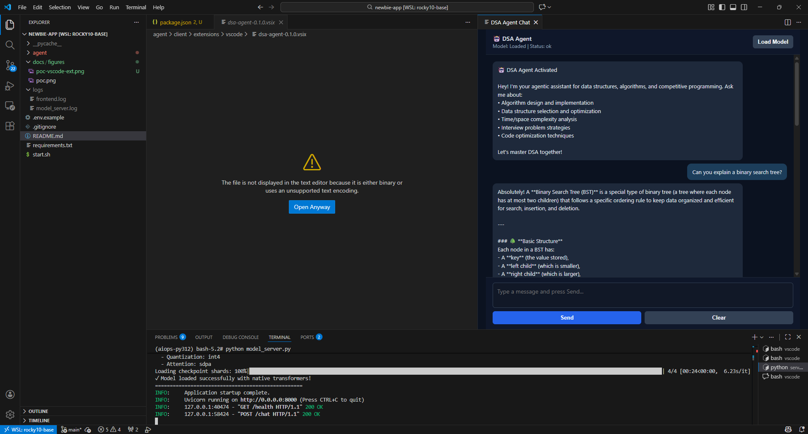

# DSA Agent - Data Structures & Algorithms Learning Platform

**DSA Agent** is an agentic VS Code extension for mastering data structures and algorithms. It brings AI-powered learning directly into your editor, supporting competitive programming, technical interview prep, and algorithm mastery.

Built with [Qwen3-VL](https://huggingface.co/Qwen/Qwen3-VL-8B-Instruct), a powerful multimodal AI model running on GPU-accelerated inference with 4-bit quantization for efficiency.

> ⚠️ **Learning Opportunity**: This project demonstrates building intelligent AI-powered VS Code extensions with disaggregated REST API backends, enabling multi-client support and scalable inference.

> 📝 **Note**: This README is AI-generated. Cleanup for ambiguous and vague information is pending. Please take it with a grain of salt and report any inaccuracies.

---

## 🎉 Recent Updates (January 28, 2026)

### VS Code Extension - Triton Integration ✅
The DSA Agent VS Code extension has been fully integrated with NVIDIA Triton Inference Server:

**What's New:**
- ✅ Direct Triton HTTP API integration (`/v2/models/qwen3-vl/infer`)
- ✅ Real-time server and model health monitoring
- ✅ Immediate user message display (no more waiting to see your input!)
- ✅ Loading indicator ("⏳ Processing...") while waiting for response
- ✅ Input disabled during inference to prevent duplicate requests
- ✅ Performance metrics showing both model and total roundtrip time
- ✅ Message history limited to 100 messages (prevents memory issues)
- ✅ Console logging for debugging (Webview DevTools)

**Files:** `agent/client/extensions/vscode/`  
**Package:** `dsa-agent-0.1.0.vsix` (12.38KB)  
**Install:** `code --install-extension dsa-agent-0.1.0.vsix --force`

### RAG System - Phase 1 Complete ✅
Complete RAG (Retrieval-Augmented Generation) infrastructure ready for Phase 2 integration:

**Implemented:**
- ✅ Qdrant vector database with scalar quantization (INT8, 75% storage reduction)
- ✅ Redis caching layer (512MB, LRU eviction, TTL=3600s)
- ✅ Token-aware document chunking (300 tokens text, 500 tokens code)
- ✅ VLM2Vec embeddings using Qwen3-VL hidden states (4096 dims)
- ✅ Async retrieval with optional reranking
- ✅ Docker services configured (Qdrant port 6333, Redis port 6379)
- ✅ Comprehensive documentation

**Not Yet Done (Phase 2):**
- ⏳ API integration with inference_engine.py
- ⏳ /chat/rag, /knowledge/search, /knowledge/ingest endpoints
- ⏳ DSA knowledge base ingestion

**Files:** `agent/memory/`  
**Docs:** [VLM2VEC_EMBEDDING_GUIDE.md](docs/VLM2VEC_EMBEDDING_GUIDE.md)

### Performance Analysis 📊
- ⚠️ Identified slow inference issue (~100s with max_new_tokens=512)
- ✅ Added detailed performance logging to Triton backend
- ✅ Created optimization guide: [TRITON_PERFORMANCE.md](TRITON_PERFORMANCE.md)
- **Quick Fix:** Set `MAX_NEW_TOKENS=128` for 4x faster inference

**See:** [CHANGELOG.md](CHANGELOG.md) for complete details

---

## Architecture

The platform uses a **disaggregated architecture** with multiple backend serving options and client frontends:

- **Backend Options**:
  - **FastAPI Server** (`agent/serving/fastapi`): Legacy server on port 8000
  - **Triton Inference Server** (`agent/serving/triton`): Production-grade GPU inference on ports 8000-8002 (HTTP/gRPC/Metrics)
- **VS Code Extension** (`agent/client/extensions/vscode`): DSA Agent extension providing editor-integrated learning
- **RAG System** (`agent/memory`): Retrieval-Augmented Generation with Qdrant vector database and Redis caching
- **Docker Compose**: Orchestrates all services with GPU support, health checks, and volume mounts

The extension communicates with backends via REST API, enabling scalability and multi-client support (CLI, web, mobile).

### RAG Integration

The platform now includes a **production-grade RAG (Retrieval-Augmented Generation) system** for enhanced learning:

- **Vector Database**: Qdrant with scalar quantization (75% storage reduction)
- **Embeddings**: VLM2Vec from Qwen3-VL (4096-dimensional embeddings)
- **Caching Layer**: Redis for embedding and query caching
- **Optimizations**: HNSW indexing, async operations, batch processing
- **Knowledge Base**: DSA algorithms, code examples, complexity analysis

**RAG Services:**
- Qdrant: `http://localhost:6333` (HTTP API), `localhost:6334` (gRPC)
- Redis: `localhost:6379` (cache layer)

## Features

- **VS Code Extension (DSA Agent)**: Agentic assistant integrated directly into your editor
- **Agentic Chat**: AI-powered responses on algorithm and data structure concepts
- **RAG-Enhanced Responses**: Context-aware answers using vector database retrieval
- **Multi-Domain Support**: Covers algorithm design, data structures, complexity analysis, interview prep
- **Production-Grade Serving**: NVIDIA Triton Inference Server with Python backend
- **Optimized Vector Search**: Qdrant with HNSW indexing and scalar quantization
- **Smart Caching**: Redis-backed embedding and query caching for <150ms retrieval latency
- **Multi-Stage Docker Builds**: Dev mode (fast iteration with host site-packages) or Prod mode (clean pip installs)
- **Health Monitoring**: Built-in health checks via Triton `/v2/health/ready` endpoint
- **Flexible Loading Strategies**: Native transformers, vLLM, TensorRT-LLM, or ONNX Runtime
- **Multiple Quantization Options**: int4, int8 via BitsAndBytes for memory efficiency
- **GPU-Accelerated Inference**: NVIDIA Container Toolkit with automatic GPU passthrough
- **Configurable Attention Mechanisms**: SDPA, Eager, or Flash Attention 2 support
- **Response Timing**: Real-time performance metrics
- **API Documentation**: Auto-generated interactive API docs via FastAPI/Triton
- **Environment-based Config**: All settings configurable via environment variables

## DSA Agent - VS Code Extension

### Overview

We've introduced **DSA Agent**, a VS Code extension that transforms the editor into an intelligent learning companion for data structures and algorithms (DSA). Rather than switching between your code and a browser window, DSA Agent brings contextual AI assistance directly into VS Code.



> 🚧 **Work in Progress**: The extension is in active development. The screenshot above shows current capabilities with more features coming soon.

**Why This Rebrand?**

The original "newbie-app" was generic and unfocused. By rebranding as **DSA Agent**, we've:
1. **Defined a clear purpose**: Not a generic chatbot, but a specialized agentic assistant for DSA learning
2. **Aligned with the model server**: Leverages the same AI infrastructure (Qwen3-VL) for consistent responses
3. **Positioned as an agent**: Emphasizes future autonomous capabilities (code generation, problem solving, test validation)
4. **Created developer focus**: Targets competitive programmers and interview prep candidates
5. **Enabled extension development**: Demonstrates how to build intelligent VS Code plugins with REST API backends

### Current Capabilities

- Real-time chat with agentic responses on algorithm and data structure questions
- Algorithm explanations with complexity analysis (Time/Space)
- Data structure selection guidance with trade-offs
- Interview problem-solving strategies
- Code review and optimization suggestions
- Server health monitoring and model status display

### Future Roadmap (Upcoming Features)

- **Code Generation Agent**: Generate algorithm implementations from descriptions
- **Problem-Solving Agent**: Step-by-step solution generation for coding problems
- **Test Case Generator**: Automatically create and validate test cases
- **Complexity Visualizer**: Visual analysis of time/space complexity
- **LeetCode/HackerRank Integration**: Pull problems directly into the extension
- **Interview Simulator**: Mock interview mode with real-time feedback
- **Visual Walkthroughs**: Animated algorithm execution traces
- **Offline Mode**: Local model inference without server dependency

### Advanced Roadmap: Specialized DSA Agents (v2.0+)

The long-term vision includes **domain-specific agentic modules** that work together to provide end-to-end DSA mastery:

#### 1. **Problem Curator Agent** 🎯
Intelligent problem recommendation engine that:
- Analyzes your skill level and learning gaps
- Recommends problems based on weak areas (e.g., "You struggle with graph DFS, try these 3 problems")
- Tracks problem-solving history and patterns
- Suggests problems by difficulty progression (easy → medium → hard)
- Integrates with LeetCode, HackerRank, Codeforces APIs
- Provides difficulty/acceptance rate metadata

#### 2. **Curriculum Strategist & Designer** 📚
Personalized learning path generator that:
- Creates custom learning plans based on interview timeline and target level
- Structures curriculum by topic clusters (arrays → strings → trees → graphs)
- Balances breadth (cover all topics) vs. depth (master weak areas)
- Recommends optimal problem sequence for retention
- Tracks progress and adjusts curriculum dynamically
- Generates study schedule (e.g., "3 problems/day for 12 weeks")
- Recommends supplementary resources (articles, videos) for each topic

#### 3. **E2E Problem, Solve, Test Environment** 🔨
Complete development environment within the extension:
- **Problem Context Panel**: Display problem statement, constraints, examples
- **Integrated Code Editor**: Write solutions with language selection (Python, Java, C++, Go)
- **Smart Test Runner**: Execute solutions against provided test cases
- **Custom Test Case Builder**: Create edge cases and stress tests
- **Performance Profiler**: Measure actual time/space complexity
- **Visual Debugger**: Step through execution with variable inspection
- **Solution History**: Track all attempts with diffs
- **Auto-Submit**: Submit to LeetCode/HackerRank directly from extension

#### 4. **Solution Hinter Agent** 💡
Progressive hint system that guides without spoiling:
- **Level 1 (Approach Hint)**: "What data structure would help here?"
- **Level 2 (Algorithm Hint)**: "Consider using DFS/BFS"
- **Level 3 (Pattern Hint)**: "This is a two-pointer problem"
- **Level 4 (Partial Code)**: Show first 20% of solution
- **Level 5 (Full Solution)**: Reveal complete solution with explanation
- User controls hint progression (can't skip to full solution)
- Tracks hint usage to identify problem areas

#### 5. **Solution Optimizer Agent** ⚡
Multi-dimensional optimization analyzer:
- **Time Complexity**: Identify bottlenecks and suggest faster approaches
- **Space Complexity**: Detect unnecessary allocations and optimize memory
- **Code Quality**: Refactor for readability (variable names, structure)
- **Best Practices**: Suggest idiomatic patterns for the language
- **Alternative Solutions**: Show 2-3 different approaches with trade-offs
- **Comparison Mode**: Side-by-side comparison of your solution vs. optimal
- **Performance Benchmarking**: Run solutions with large inputs (10^5 - 10^6 scale)

---

### Agent Collaboration Flow (Future Vision)

```
User Opens Extension
      ↓
Problem Curator → Recommends problem based on skill level
      ↓
E2E Environment → User codes solution
      ↓
Solution Hinter → User stuck? Get progressive hints
      ↓
Solution Optimizer → Analyze time/space, suggest improvements
      ↓
Curriculum Strategist → Next problems to master, update learning plan
      ↓
[Repeat until interview/goals achieved]
```

This multi-agent architecture ensures:
- **Personalization**: Every user gets custom learning paths
- **Guidance without dependency**: Hints teach problem-solving, not just answers
- **Continuous improvement**: Optimization feedback builds good coding habits
- **Accountability**: Progress tracking and adaptive difficulty
- **Real-world readiness**: Full IDE-like environment prepares for actual coding interviews

### Installation & Use

```bash
# Build the extension
cd agent/client/extensions/vscode
npm install
npm run compile

# Package as .vsix
npm run package

# Install in VS Code
# Extensions → Install from VSIX → select dsa-agent-0.1.0.vsix
```

Then in VS Code Command Palette:
- `DSA Agent: Start` - Welcome message and status check
- `DSA Agent: Open Assistant` - Open the chat panel

### Architecture

The extension follows the same disaggregated pattern as the web app:
- **Frontend**: VS Code WebView (HTML/CSS/JS + TypeScript)
- **Backend**: Model server (FastAPI on port 8000)
- **Communication**: REST API via `fetch()`

This allows the extension to reuse the same model server as the Gradio app, enabling seamless multi-client support.

---

## RAG System Overview

The platform includes an optimized **Retrieval-Augmented Generation (RAG) system** that enhances AI responses with relevant knowledge from a vector database.

### How RAG Works

```
User Query → Embed Query → Search Vector DB → Retrieve Context → Augment Prompt → Generate Response
                ↓                   ↓                 ↓
           Qwen3-VL            Qdrant           Top-K Docs
           (4096 dims)      (Cosine Similarity)  (with scores)
```

### RAG Components

**1. Embeddings (`agent/memory/embeddings.py`)**
- Extracts hidden states from Qwen3-VL encoder
- 4096-dimensional vectors (Qwen3-VL hidden size)
- Optional PCA reduction to 768 dimensions
- Supports text-only and multimodal (text + image) embeddings

**2. Vector Store (`agent/memory/vector_store.py`)**
- Qdrant vector database with scalar quantization
- HNSW indexing (m=16, ef_construct=200)
- 75% storage reduction with INT8 quantization
- Async operations for non-blocking I/O

**3. Retriever (`agent/memory/retriever.py`)**
- Async context retrieval with Redis caching
- Top-K similarity search with score thresholding
- Context formatting for LLM prompts
- Optional reranking for improved relevance

**4. Document Chunking (`agent/memory/chunking.py`)**
- Token-aware chunking with tiktoken
- Text chunks: ~300 tokens with 50-token overlap
- Code chunks: ~500 tokens at function/class boundaries
- Preserves semantic coherence

### Resource Requirements (with RAG)

| Component | Storage | Memory | Notes |
|-----------|---------|--------|-------|
| Qwen3-VL (int4) | 10-12GB | 5-6GB VRAM | Existing model |
| Qdrant (10k docs) | 600MB | 512MB-1GB | With scalar quantization |
| Redis Cache | 50MB | 512MB | LRU eviction |
| **Total RAG Overhead** | **~700MB** | **~1-1.5GB** | Minimal impact |

### Performance Metrics

| Operation | Latency | Throughput |
|-----------|---------|------------|
| Text Embedding | ~100ms | 100-200/sec |
| Multimodal Embedding | ~300ms | 30-50/sec |
| Vector Search (10k docs) | ~10-20ms | High |
| End-to-End Retrieval | **~120-150ms** | Acceptable |
| Cache Hit | ~5ms | Very fast |

---

## Setup

### Prerequisites

- NVIDIA GPU with CUDA support (recommended: 8GB+ VRAM for int4 quantization, 15GB+ for native)
- Conda environment with Python 3.12
- Qwen3-VL-8B-Instruct model downloaded
- VS Code with extension support
- **Docker and Docker Compose** (for RAG services)

### 1. Install Backend Dependencies

```bash
conda activate aiops-py312
pip install -r requirements.txt
```

New RAG dependencies:
- `qdrant-client` - Qdrant vector database client
- `redis` - Redis caching client
- `langchain` - RAG orchestration
- `tiktoken` - Token counting for chunking
- `scikit-learn` - Optional PCA dimension reduction

### 2. Start RAG Services (Docker Compose)

Start Qdrant and Redis:
```bash
# Create data directories
mkdir -p data/qdrant data/redis

# Start services
docker-compose up -d qdrant redis

# Check health
curl http://localhost:6333/healthz  # Qdrant
redis-cli ping  # Redis (should return PONG)
```

**Service Ports:**
- Qdrant HTTP: `http://localhost:6333`
- Qdrant gRPC: `localhost:6334`
- Redis: `localhost:6379`

### 3. Configure Environment

Copy and configure `.env.example`:
```bash
cp .env.example .env
```

**RAG Configuration:**
```bash
# Enable RAG
ENABLE_RAG=true

# Qdrant
QDRANT_HOST=localhost
QDRANT_PORT=6333

# Redis
REDIS_HOST=localhost
REDIS_PORT=6379
REDIS_ENABLED=true

# Retrieval
TOP_K=3
SCORE_THRESHOLD=0.7
```

### 4. Verify Qwen Model Path

The backend expects the Qwen3-VL model at:
```
/root/workspace/lnd/aiops/vlm/Qwen/Qwen3-VL-8B-Instruct
```

To use a different path, update `MODEL_PATH` in `agent/serving/model_server.py`:

```python
MODEL_PATH = Path("/path/to/your/Qwen3-VL-8B-Instruct")
```

### 3. Start the Backend Model Server

```bash
cd /root/workspace/lnd/aiops/apps/newbie-app
conda run -n aiops-py312 python agent/serving/model_server.py
```

The server will:
- Load the Qwen3-VL model (takes 30-60 seconds on first run)
- Start listening on `http://localhost:8000`
- Display API docs at `http://localhost:8000/docs`

You'll see:
```
INFO:     Started server process [XXXX]
INFO:     Uvicorn running on http://0.0.0.0:8000 (Press CTRL+C to quit)
```

### 4. Install DSA Agent VS Code Extension

**Option A: Build from source**
```bash
cd agent/client/extensions/vscode
npm install
npm run compile
npm run package
```

Then in VS Code: `Extensions → Install from VSIX → select dsa-agent-0.1.0.vsix`

**Option B: Use pre-built package**
```bash
# Copy the .vsix file if available
cp agent/client/extensions/vscode/dsa-agent-0.1.0.vsix ~/Downloads/
```

Then in VS Code: `Extensions → Install from VSIX → ~/Downloads/dsa-agent-0.1.0.vsix`

### 5. Use DSA Agent

With both the backend running and extension installed:

1. Open VS Code Command Palette (`Ctrl+Shift+P` / `Cmd+Shift+P`)
2. Run `DSA Agent: Open Assistant` to open the chat panel
3. Ensure the status shows "Model: Loaded | Status: ok"
4. Start asking questions about data structures, algorithms, or interview prep
5. Click **Check Status** to verify Triton server connection

## Configuration

The model server supports **flexible loading strategies** via environment variables. Copy `.env.example` to `.env` and customize:

```bash
cp .env.example .env
```

### Loading Strategies

**Option 1: Native Loading (transformers)**
```bash
LOADING_STRATEGY=native
QUANTIZATION_TYPE=int4        # none, int4, int8
ATTENTION_IMPL=sdpa          # eager, sdpa, flash_attention_2
```

**Option 2: vLLM Loading (High Performance)**
```bash
LOADING_STRATEGY=vllm
QUANTIZATION_TYPE=none        # none, awq, gptq (requires pre-quantized model)
VLLM_GPU_MEMORY_UTILIZATION=0.9
VLLM_TENSOR_PARALLEL_SIZE=1
```

### Key Parameters

```bash
MODEL_PATH=/root/workspace/lnd/aiops/vlm/Qwen/Qwen3-VL-8B-Instruct
MAX_HISTORY=5              # Conversation history to keep
MAX_NEW_TOKENS=512         # Max tokens per response
```

Generation parameters (temperature=0.7, top_p=0.9) are configured in `model_server.py`.

### Physical Resource Requirements

**⚠️ CRITICAL: vLLM has significantly higher RAM requirements than native loading**

| Loading Strategy | GPU (VRAM) | System RAM | Storage | Best For |
|-----------------|------------|------------|---------|----------|
| **Native + int4** | 5-6GB | 8-10GB | 20GB | Limited RAM systems (≤16GB) |
| **Native + int8** | 8-10GB | 10-12GB | 20GB | Balanced quality/memory |
| **Native + none** | 14-16GB | 12-14GB | 20GB | High quality, moderate speed |
| **vLLM + none** | 15-19GB | **24-32GB** | 30GB | High throughput servers |
| **vLLM + quantized** | 10-14GB | **24-32GB** | 30GB | Production with pre-quantized models |

**vLLM Resource Breakdown:**
```
Component              System RAM    GPU VRAM
─────────────────────────────────────────────
Model weights          10-12GB       10-12GB (FP16)
Python process         2-3GB         -
Ray worker overhead    3-5GB         -
vLLM engine core       4-6GB         2-3GB
KV cache allocation    -             3-4GB
─────────────────────────────────────────────
TOTAL                  19-26GB       15-19GB
```

**💡 Recommendations:**
- **16GB RAM or less**: Use `LOADING_STRATEGY=native` with `QUANTIZATION_TYPE=int4`
- **24GB RAM**: vLLM usable but may experience slowdowns
- **32GB+ RAM**: vLLM recommended for best performance
- **GPU Memory**: RTX 5060 Ti 16GB / RTX 3090 24GB / RTX 4090 24GB maybe sufficient for both strategies

### Quantization Options

| Type | Strategy | VRAM | Quality | Speed | Notes |
|------|----------|------|---------|-------|-------|
| `none` | Both | ~16GB | Best | Baseline | Full precision (FP16/BF16) |
| `int4` | Native | ~5-6GB | Good | Fast | BitsAndBytes 4-bit ✓ Recommended for low RAM |
| `int8` | Native | ~8-10GB | Very Good | Medium | BitsAndBytes 8-bit |
| `awq` | vLLM | ~8GB | Good | Very Fast | Requires pre-quantized model |
| `gptq` | vLLM | ~8GB | Good | Very Fast | Requires pre-quantized model |
| `fp8` | vLLM | ~10GB | Excellent | Very Fast | H100+ GPUs only |
| `squeezellm` | vLLM | ~8GB | Good | Very Fast | Requires pre-quantized model |

**⚠️ Important Notes on vLLM Quantization:**

- **AWQ, GPTQ, SqueezeLLM** require models that have been **pre-quantized** with that specific method
- You **cannot** use these with a standard model checkpoint
- If you get an error like "Cannot find the config file for awq", your model is not quantized
- **FP8** works with any model but requires H100 or newer GPUs
- **For standard models with vLLM, use `QUANTIZATION_TYPE=none`**

**Using Pre-quantized Models:**

To use AWQ/GPTQ quantization, you need to either:
1. Download a pre-quantized model from HuggingFace (search for "[model-name]-AWQ" or "[model-name]-GPTQ")
2. Quantize your model using AutoAWQ or AutoGPTQ libraries
3. Update `MODEL_PATH` to point to the quantized checkpoint

## Troubleshooting

### Model Server Not Starting
- **Check model path exists**: `ls /root/workspace/lnd/aiops/vlm/Qwen/Qwen3-VL-8B-Instruct`
- **Check GPU memory**: `nvidia-smi` (requires ~8-10GB VRAM with 4-bit quantization)
- **Verify dependencies**: `conda run -n aiops-py312 pip list | grep -E "torch|transformers|bitsandbytes"`
- **Check CUDA**: `python -c "import torch; print(torch.cuda.is_available())"`

### Extension Cannot Connect to Server
- Ensure model server is running on port 8000: `curl http://localhost:8000/health`
- Check if backend returned error message in chat panel
- Verify localhost access: `netstat -tlnp | grep 8000`
- Check logs: `tail -f logs/model_server.log`

### Out of Memory (OOM)
- **Reduce max tokens**: Lower `MAX_NEW_TOKENS` in config (e.g., 256)
- **Close other GPU processes**: `nvidia-smi` to check what's using VRAM
- **Ensure quantization**: Verify 4-bit quantization is enabled
- **Use vLLM**: Consider switching to vLLM if native is memory-constrained

## References

- [Qwen3-VL Model](https://huggingface.co/Qwen/Qwen3-VL-8B-Instruct) - Vision-Language model from Qwen
- [FastAPI Documentation](https://fastapi.tiangolo.com/) - Modern REST API framework
- [Hugging Face Transformers](https://huggingface.co/docs/transformers) - Model loading and inference
- [BitsAndBytes](https://github.com/TimDettmers/bitsandbytes) - 4-bit quantization library
- [VS Code Extension API](https://code.visualstudio.com/api) - Building VS Code extensions

---


## Notes

- The backend uses **4-bit quantization** to reduce VRAM requirements from ~32GB to ~8-10GB
- **GPU acceleration** is automatic via `device_map="auto"` in model loading
- Model loads on server startup - expect 30-60 second initialization time on first run
- Logs are stored in `logs/` directory for debugging
- DSA Agent is designed for educational use and technical interview preparation
- The disaggregated architecture allows easy addition of new client interfaces (CLI, mobile, etc.)

---

**Happy learning! Master DSA with AI-powered guidance. 🚀**
